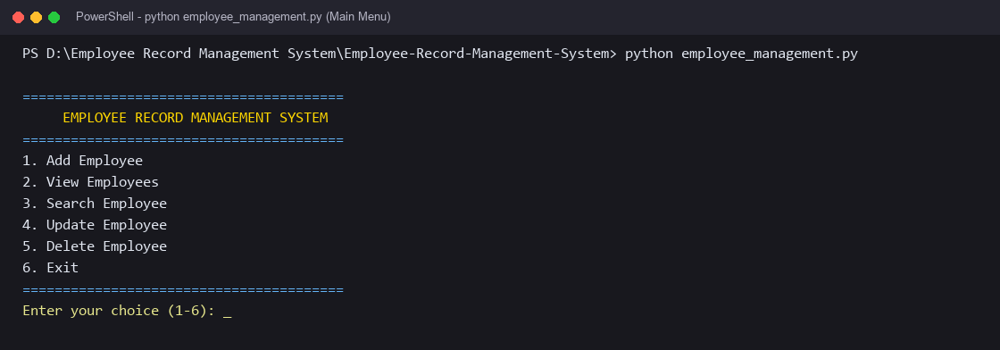
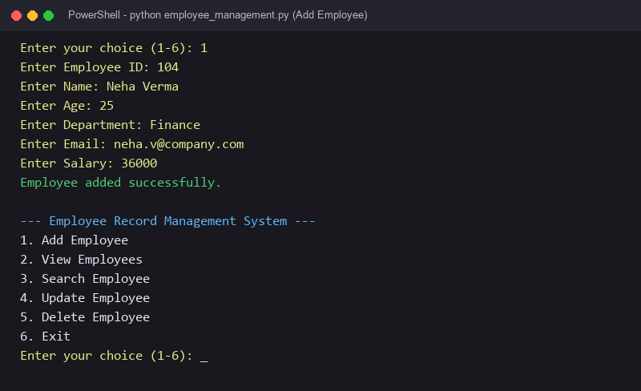
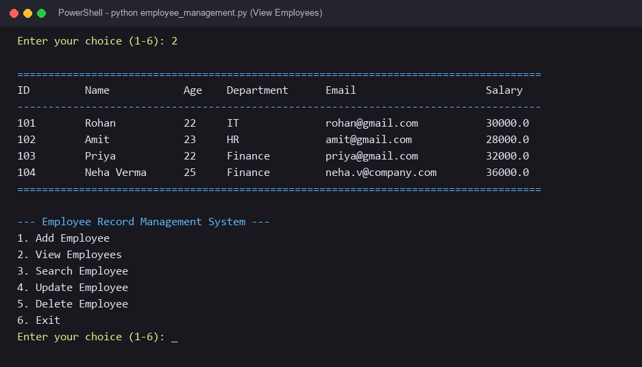
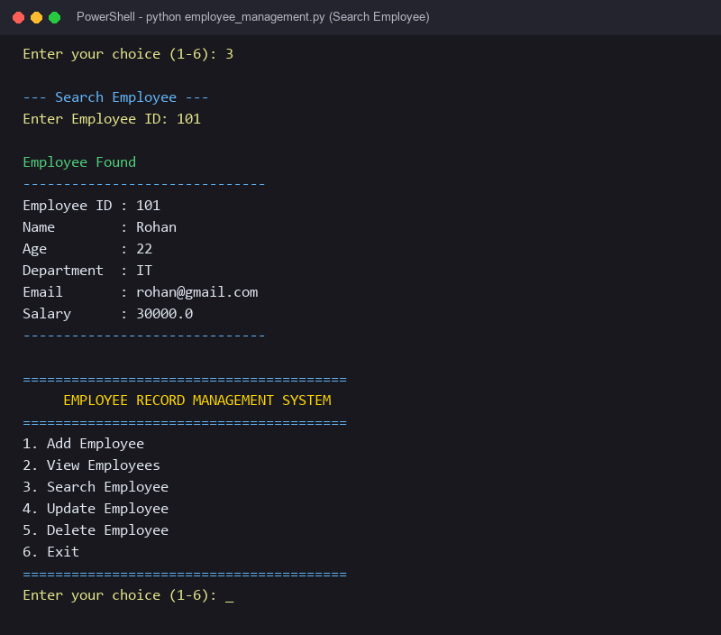
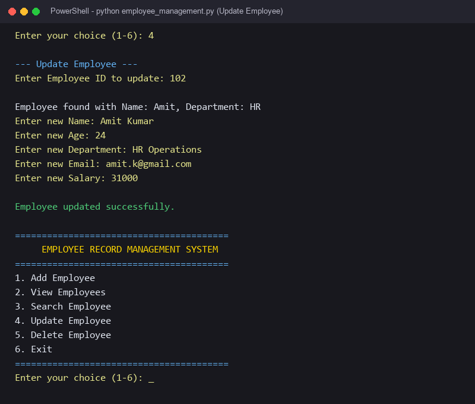
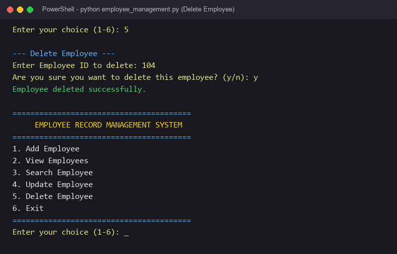
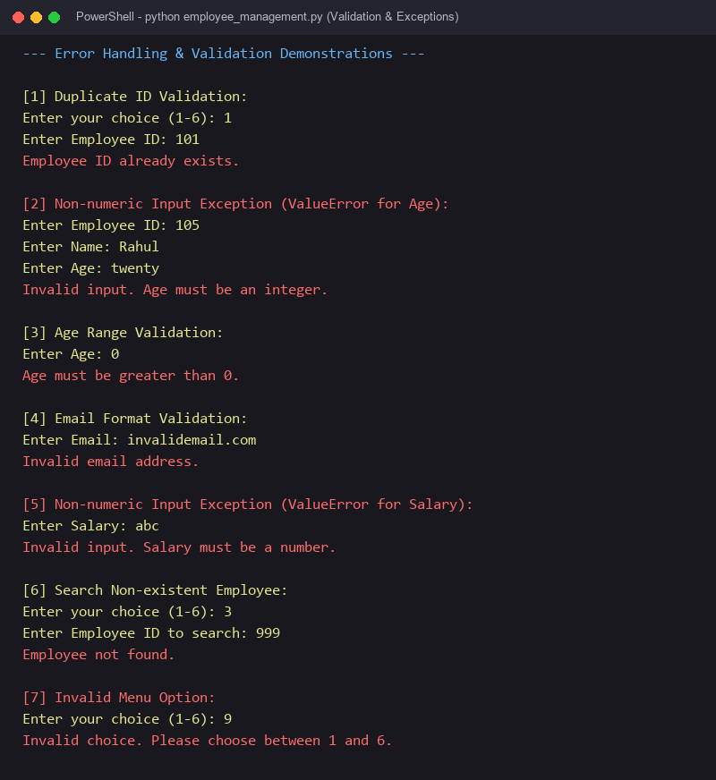

# Employee Record Management System

A beginner-friendly, console-based Employee Record Management System built using Python and CSV File I/O. Developed as part of **MCA Semester I – Python Programming & Relational Database (Assignment 1)**.

---

## Description

The **Employee Record Management System** is a menu-driven Python application designed to manage employee details efficiently without requiring complex database engines. Employee data is permanently saved in a CSV (Comma-Separated Values) file (`employees.csv`), ensuring that records remain intact even after the program is closed.

---

## Features

* **Add Employee:** Add new records with unique Employee ID and validated fields.
* **View Employees:** Display all stored records in a clean, formatted table.
* **Search Employee:** Quickly search and view details of any employee by their ID.
* **Update Employee:** Modify employee details (Name, Age, Department, Email, Salary) while keeping Employee ID unchanged.
* **Delete Employee:** Remove an employee record with a safety confirmation prompt (`y`/`n`).
* **CSV File Storage:** Automatically creates and updates `employees.csv` using Python's built-in `csv` module.
* **Input Validation:** Enforces non-empty values, numeric IDs, age limits (18–65), email format checks, and non-negative salaries.
* **Exception Handling:** Gracefully handles invalid inputs (`ValueError`) and file access errors (`FileNotFoundError`, `PermissionError`, `IOError`).
* **Menu-driven Interface:** Interactive command-line menu running in a continuous loop until exited.

---

## Technologies Used

* **Python 3**
* **CSV (Comma-Separated Values)**
* **File I/O**
* **Python standard library (`csv`, `os`)**

---

## Python Concepts Used

* **Variables and Data Types:** Utilized `string` (Name, Department, Email), `integer` (Age), `float` (Salary), and `boolean` (flags for search/existence).
* **Conditional Statements (`if`, `elif`, `else`):** Used for menu routing, ID duplication checks, and input validations.
* **Loops (`while`, `for`):** `while` loop maintains the continuous menu lifecycle; `for` loop iterates through CSV rows.
* **Functions:** Procedural design breaking operations into focused functions (`add_employee()`, `view_employees()`, `search_employee()`, etc.).
* **Exception Handling (`try`, `except`):** Prevents crashes on non-numeric inputs and file permission/access errors.
* **File I/O (`with open(...)`):** Manages file open, read, append, and rewrite operations cleanly.
* **Lists:** Stores and iterates over collections of employee records.
* **Dictionaries:** Represents each employee as a structured key-value mapping (`employee_id`, `name`, `age`, `department`, `email`, `salary`).
* **Menu-Driven Programming:** Uses standard I/O to present clear numerical options for intuitive navigation.

---

## Project Structure

```text
Employee-Record-Management-System/
│
├── employee_management.py      # Main Python application
├── employees.csv               # CSV file storing employee records
├── README.md                   # Project overview and instructions
├── Assignment_Report.md        # Comprehensive MCA Semester I report
├── test_cases.md               # Documented test cases and results
├── .gitignore                  # Git ignore file for temporary files
│
└── screenshots/                # Terminal output screenshots
    ├── main_menu.png
    ├── add_employee.png
    ├── view_employees.png
    ├── search_employee.png
    ├── update_employee.png
    ├── delete_employee.png
    └── error_handling.png
```

---

## How to Run

### Prerequisites
* **Python 3.x** must be installed on your computer.

### Steps

1. Open your terminal or command prompt (PowerShell / Command Prompt / Bash).
2. Navigate to the project directory:
   ```bash
   cd "Employee-Record-Management-System"
   ```
3. Run the program:
   ```bash
   python employee_management.py
   ```

---

## Sample Output

### Main Menu
```text
========================================
     EMPLOYEE RECORD MANAGEMENT SYSTEM
========================================
1. Add Employee
2. View Employees
3. Search Employee
4. Update Employee
5. Delete Employee
6. Exit
========================================
Enter your choice (1-6):
```

### Viewing Records
```text
--- View Employees ---
---------------------------------------------------------------------------
ID      Name           Age     Department     Email               Salary    
---------------------------------------------------------------------------
101     Rohan          22      IT             rohan@gmail.com     30000.0   
102     Amit           23      HR             amit@gmail.com      28000.0   
103     Priya          22      Finance        priya@gmail.com     32000.0   
---------------------------------------------------------------------------
```

### Searching an Employee
```text
--- Search Employee ---
Enter Employee ID: 101

Employee Found
------------------------------
Employee ID : 101
Name        : Rohan
Age         : 22
Department  : IT
Email       : rohan@gmail.com
Salary      : 30000.0
------------------------------
```

---

## Screenshots

* **Main Menu:**  
  

* **Add Employee:**  
  

* **View Employees:**  
  

* **Search Employee:**  
  

* **Update Employee:**  
  

* **Delete Employee:**  
  

* **Error Handling & Validation:**  
  

---

## GitHub Repository

GitHub Repository: [ADD REPOSITORY LINK]
